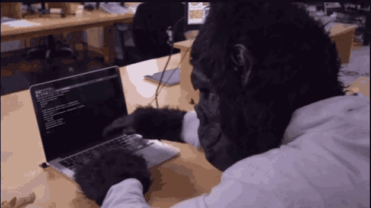

# Hi! 🙋‍♂️
### This is my Personal Web Portfolio 💼


I wanted to delve into the `Astro` framework, so I decided to create my **Personal Web Portfolio** with it. Below are some basic instructions about the process.

- I used [bun](https://bun.sh/) to download and initialize the project
    ```sh
    bun create astro@latest
    ```
- As I alread mentioned, I'll be using [Astro](https://astro.build/) in order to create a static web site, without much logic behind

## 🚀 Project Structure

Inside this Astro project, you'll see the following folders and files:

```text
/
├── public/
│   └── favicon.svg
├── src/
│   ├── components/
│   │   └── Card.astro
│   ├── layouts/
│   │   └── Layout.astro
│   └── pages/
│       └── index.astro
└── package.json
```

### ⛏ How Astro works
- Astro looks for `.astro` or `.md` files in the `src/pages/` directory. Each page is exposed as a route based on its file name.
- There's nothing special about `src/components/`, but that's where we like to put any Astro/React/Vue/Svelte/Preact components.
- Any static assets, like images, can be placed in the `public/` directory.

### 🧞 Commands

All commands are run from the root of the project, from a terminal:

| Command                   | Action                                           |
| :------------------------ | :----------------------------------------------- |
| `bun install`             | Installs dependencies                            |
| `bun run dev`             | Starts local dev server at `localhost:4321`      |
| `bun run build`           | Build your production site to `./dist/`          |
| `bun run preview`         | Preview your build locally, before deploying     |
| `bun run astro ...`       | Run CLI commands like `astro add`, `astro check` |
| `bun run astro -- --help` | Get help using the Astro CLI                     |

## 👀 Want to learn more?

Feel free to check [Astro documentation](https://docs.astro.build) or jump into the [Discord server](https://astro.build/chat).
